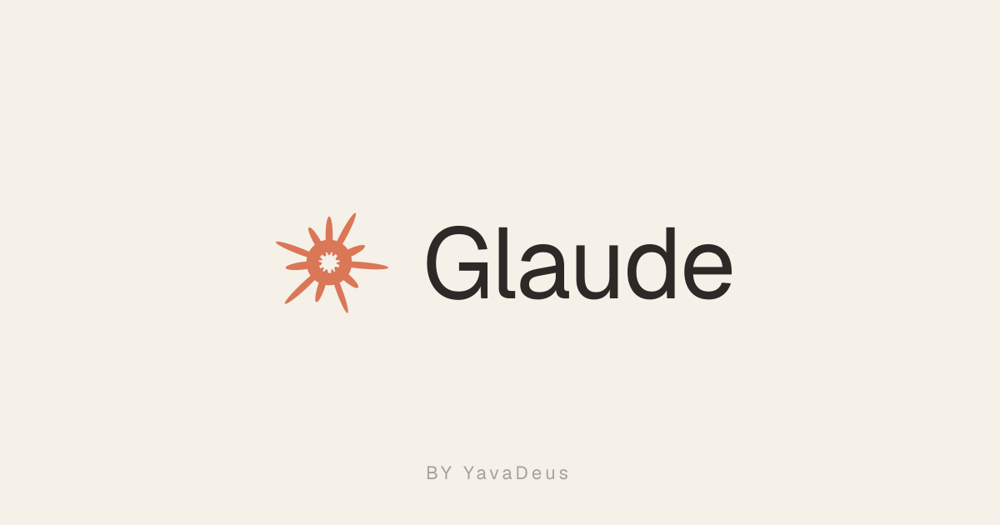

# Glaude



> Le nouvel agent IA. Connecté à l'univers.

**Glaude** répond à toutes vos questions. Rapidement. Gratuitement.

Construit avec Next.js 16 (App Router), React 19, TypeScript et Tailwind CSS v4.

---

## Lancer le projet

```bash
make install   # installe les dépendances
make start     # démarre le serveur de dev sur http://localhost:4321
```

Autres commandes :

```bash
make build        # build de production
make lint         # ESLint
make typecheck    # vérification TypeScript
make format       # Prettier (à lancer après chaque modification)
make format-check # vérifie le formatage sans modifier
```

---

## Fonctionnalités

- Répond à toutes vos questions
- Connaissance approfondie de la cuisine au chou
- Dictée vocale (`fr-FR`)
- Mode GLAUDE GODE

---

## Stack technique

| Outil        | Version         |
| ------------ | --------------- |
| Next.js      | 16 (App Router) |
| React        | 19              |
| TypeScript   | 5               |
| Tailwind CSS | v4              |

- Port de développement : **4321**
- Données persistées en localStorage
- Pas de backend
